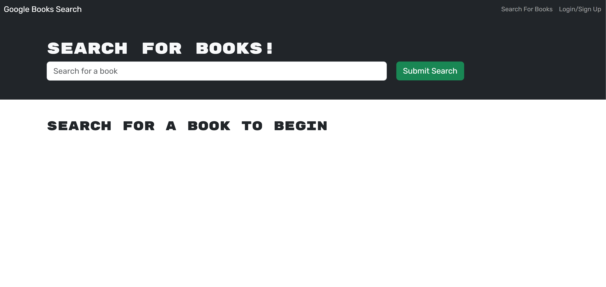

# [Book Search Engine](https://evening-fjord-51200-47c743c3d529.herokuapp.com/)

  ## Table of Contents
  - [Description](#description📝)
  - [Installation](#installation💻)
  - [Usage](#usage👨‍💻)
  - [Features](#features🎁)
  - [Credits](#credits📣)
  - [Resources](#resources🛠️)
  - [License](#licenses🔍)

## Description📝

This project constitutes a sophisticated book search engine that empowers users to search for books based on their titles. Furthermore, upon logging in, users gain the functionality to save their preferred books to a personalized list, aptly named "My Saved Books."

## Installation💻
The provided URL will redirect users to a user-friendly website, obviating the need for any user-initiated installations. This application supports most browsers and mobile devices.
- [Live Demo Link](https://evening-fjord-51200-47c743c3d529.herokuapp.com/)
- [Github Repo Code](https://github.com/JMorante89/Book-Search-Engine)

## Usage👨‍💻
### The homepage offers immediate access a serch form that can easily give you   

### If the user clicks in the top right corner that says "login" they will have the ability to sign in if they are an existing user or signup if they are a new member.

## Features🎁
    -Easy UI to follow  
    -Contact Me options are readily available for easy communication 
    -All projects and contact links are live to learn more about me

 ## Credits📣
- Daniel Morante 
  [Github Profile JMorante89](https://github.com/JMorante89)

## Resources🛠️
- GWU tutoring
- Apple Memoji

## Licenses🔍
   